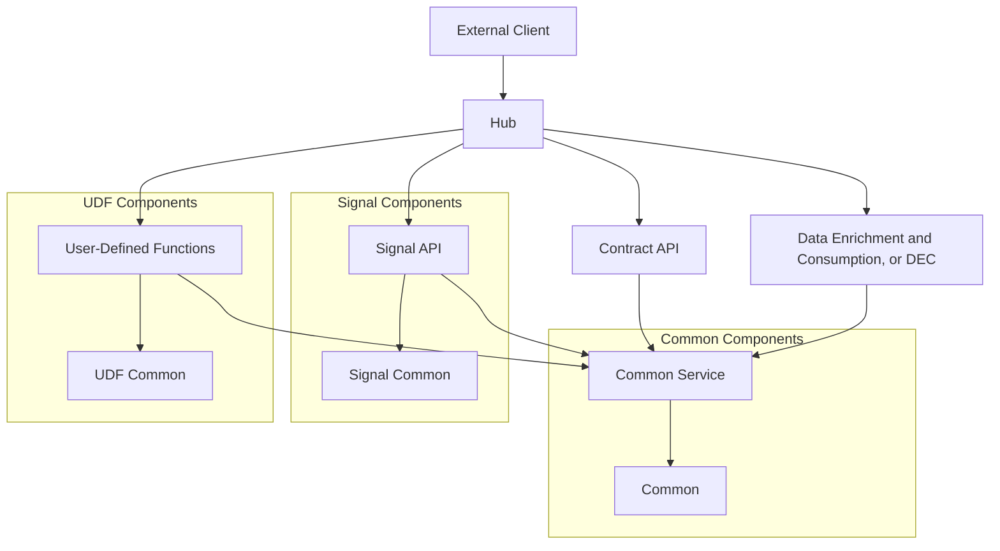

# System Architecture

## GDS-MDM-Parent Architecture Overview

This document describes the high-level architecture of the GDS-MDM-Parent system, including component relationships and data flows.

## Architectural Layers

The system follows a layered architecture:

1. **API Layer**: Defined in the contract module, providing external interfaces
2. **Service Layer**: Implemented across various modules (ignal, dec (Data Enrichment and Consumption), hub)
3. **Data Access Layer**: Handles persistence and data retrieval operations based on MySQL database (or H2 for tests), Hibernate and Spring Data
4. **Common Models and Utilities**: Shared functionality in common and common-svc modules
5. **Hub application**: A spring-boot application that combines all module APIs.

## Component Relationships

## Deployment Architecture

Based on the configuration files (application-*.yaml), the system support multiple environments:

- Dev
- Feature
- Staging
- Pre-Production
- Production

Each environment has specific configuration parameters defined in the respective YAML files.

## Integration Points

## Additional Notes

This architecture overview is based on the observed file structure. For more detailed information about specific components, refer to the other documentation files in this directory.
